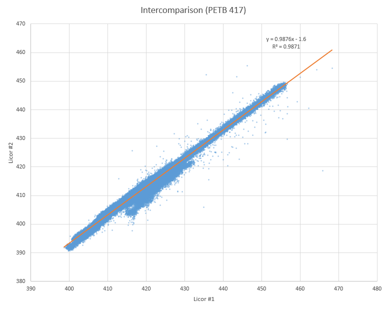

# Data sets

### Plume dispersion calculations

An [Excel&trade; workbook](GaussCalcs_CO2.xlsx) put together by Dr. Brian Lamb
for estimating required point-source tracer delivery rates to attain meaningful
concentration differences. 

### 2018 June 5

Combined CO2/PM tracer release test, Paccar ETB roof top. Collected data has
not been adjusted for analyzer calibration discrepancies (see 2018-05-06 data).

* [Collected data (.zip)](20180605_roof_test/20180605_roof_test.zip)
* [Data summary (.xlsx)](20180605_roof_test/20180605_roof_test.xlsx)

The downwind gas analyzer was located ~10 meters (6-7 paces) from the point
release of CO2. Winds were consistently from the East. Upwind sonic
anemometer and gas analyzer were located almost 3 meters from the point
release source.

We were able to observe the plume from ~10 meters (6-7 paces):

Some additional time-series plots:

### 2018 May 6-9th

Data collected by co-located LI-840A units #1 and 2, inside Paccar ETB 417.

Performance data ([zip archive](20180506_co2_prep/2018-05-06_Licor_comparison.zip)) was evaluated with Excel:

| CO2   | Licor #1   | Licor #2    |
|-------|------------|-------------|
| mean  |419.0423738 | 412.2458884 |
| stdev | 10.2546315 | 10.1936601  |

Regression eqn: `y = 0.9876x - 1.6`

